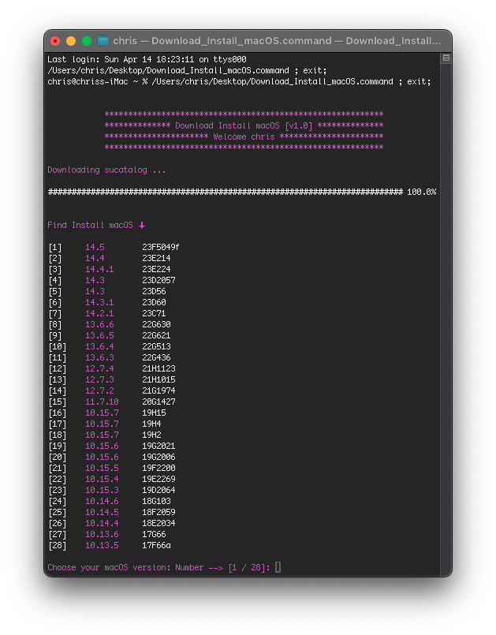
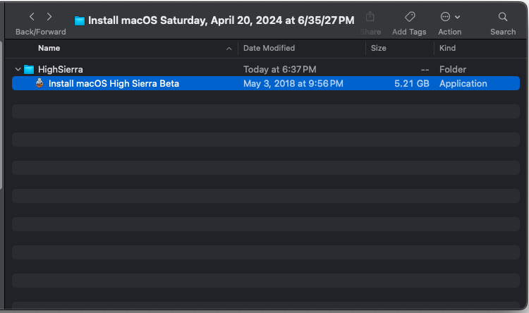
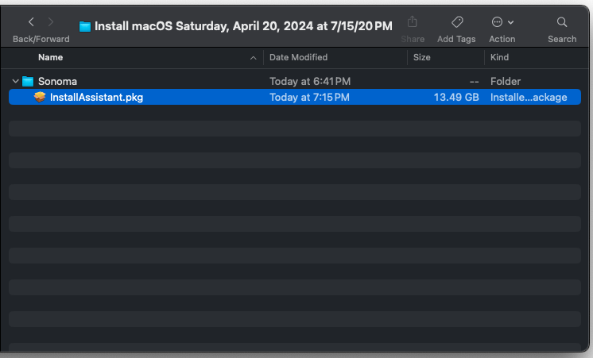

# Download_Install_macOS
### Bash script to download macOS installers from Apple server (Beta included).
### At the end you will have to save the macOS install in a chosen directory.
  
- Base: on [heinthanth · he/him work](https://github.com/htmm/macos-bootable-usb)
- SHC: [Generic Script Compiler Version 3.8.9b](https://github.com/chris1111/SHC-3.8.9b)

### 🎦 How to use ➤ [Usage Video](https://github.com/chris1111/Download_Install_macOS/blob/main/Usage.md)

Download ➤ [Release](https://github.com/chris1111/Download_Install_macOS/releases)

Download Nightly ➤ [Artifacts](https://nightly.link/chris1111/Download_Install_macOS/workflows/Build/main/Download_Install_macOS036d218.zip)



Choice [28] = 10.13.5 ➢ 17F66a ⬇︎



Choice [1] = 14.5 ➢ 23F5059e ⬇︎




- [x] `Building from Xcode:`

#### Clone the repository
```bash
git clone https://github.com/chris1111/Download_Install_macOS.git
cd $HOME/Download_Install_macOS
```

#### Build
```bash
make
```
